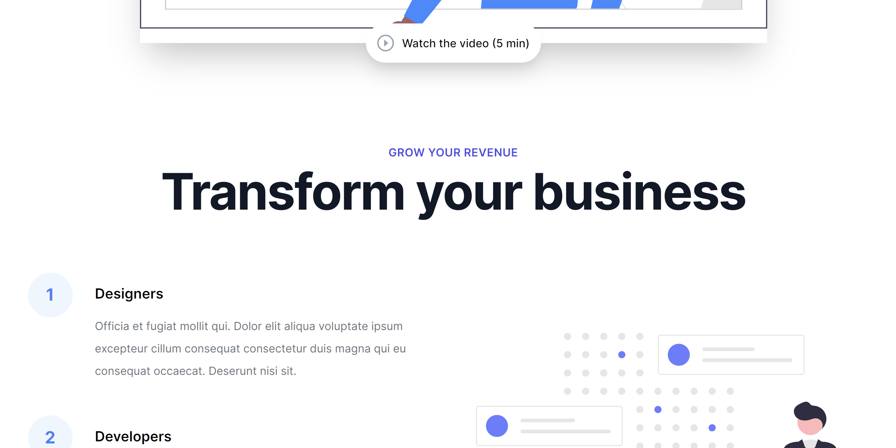

  

  
  
  

 

A landing page build with Next.js TypeScript.

<a href="https://next-startd.vercel.app">Live demo</a>

- **Next.js** — The React Framework
- **next-seo** — Manage SEO easily
- **Twind** — The smallest, fastest, most feature complete Tailwind-in-JS solution in existence
- **ESLint** — Pluggable JavaScript linter
- **Prettier** — Opinionated Code Formatter
- **Renovate** — Dependency update tool
- **lint-staged** — Run linters against staged git files
- **Absolute import** — Import folders and files using the `@` prefix

## Acknowledgments

- Next JS
- Next SEO
- Twind
- jkytoela (https://github.com/jkytoela/next-startd)
- Turbo Logo (<a href="https://www.vecteezy.com/free-vector/car">Car Vectors by Vecteezy</a>)
- Subaru car (<a href="https://icon-library.com/icon/subaru-icon-21.html.html">Subaru Icon # 363556</a>)

## License

This project is licensed under the MIT License - see the [LICENSE.md](LICENSE.md) file for more information.
